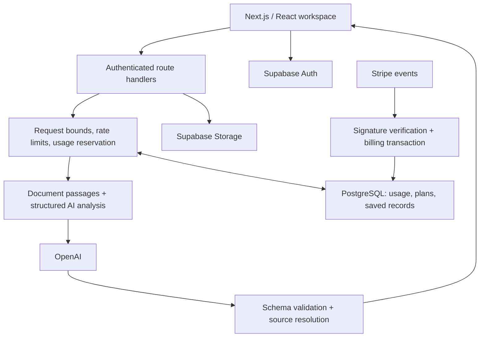

# ScreenMe

**A full-stack career workspace with evidence-backed AI analysis, transactional usage accounting, and subscription billing.**

[Open ScreenMe](https://www.screenme.dev) · [Analysis design](docs/tools-v2.md) · [Test suite](tests) · [Development setup](#local-development)

ScreenMe brings resume review, job-description comparison, resume tailoring, cover letters, interview practice, and application tracking into one authenticated workspace. The implementation combines a Next.js/TypeScript application with PostgreSQL-backed account state, Supabase authentication and storage, OpenAI inference, and Stripe subscriptions.

## Engineering highlights

- **Evidence provenance:** resume and job text are segmented into numbered source passages. The response schema restricts model-selected evidence to those passage IDs; the server resolves references back to original text. This prevents fabricated citation text while leaving the model's interpretation subject to review.
- **Runtime validation:** Zod schemas and application validators check response structure, evidence/status consistency, duplicate requirements, and input bounds. A versioned request header rejects stale analysis clients rather than returning an incompatible payload.
- **Deterministic scoring:** job requirement coverage is computed in application code using explicit weights: required = 3, unspecified = 2, preferred = 1; supported = full credit, partial = half, not evidenced = zero. The result measures documented coverage of extracted requirements.
- **Concurrency control:** authenticated AI routes reserve allowance through database transactions before provider work. Successful requests settle reservations; failures refund them. Database-backed limits coordinate requests across application instances.
- **Idempotent billing:** webhook signatures authenticate payment events. Delivery receipts and entitlement changes commit atomically, and the handler retrieves current subscription state to accommodate delayed or out-of-order events.
- **Authorization boundaries:** saved-record writes use authenticated server routes, while owner-scoped reads and database policies constrain access. Plan-aware database triggers serialize saves against account limits.
- **Failure-oriented tests:** the suite covers duplicate payment delivery, rollback, concurrent quota use, cross-account isolation, evidence rejection, PDF extraction, and private-network URL rejection.

## Architecture



The scanner and matcher share an analysis engine. Tailoring, cover letters, and interview tools have separate generation routes. Model credentials, privileged database access, and entitlement changes stay on the server.

## Core workflows

| Workflow | Implementation |
| --- | --- |
| Resume review | Qualitative assessments of clarity, impact, and organization, plus prioritized findings linked to source passages |
| Job comparison | Required/preferred qualification groups, supporting resume evidence, and weighted coverage |
| Document generation | Resume tailoring and cover letters based on supplied career information |
| Interview practice | Interview preparation and conversational practice for Pro accounts |
| Career records | Saved resumes, an application tracker, and a user-specific dashboard |
| Billing | On-site subscription checkout, billing portal, and webhook-driven plan updates |

## Code map

| Area | Entry points |
| --- | --- |
| Analysis orchestration | [analysisEngine.ts](src/app/lib/analysisEngine.ts), [analysisEvidence.ts](src/app/lib/analysisEvidence.ts), [analysisV2.ts](src/app/lib/analysisV2.ts) |
| Request lifecycle | [aiRequest.ts](src/app/lib/aiRequest.ts), [auth.ts](src/app/lib/auth.ts), [rate-limit.ts](src/app/lib/rate-limit.ts) |
| Billing | [billing.ts](src/app/lib/billing.ts), [webhook route](src/app/api/stripe/webhook/route.ts) |
| Persistence and invariants | [Schema baseline](supabase/schema-baseline.sql), [migrations](supabase/migrations) |
| Verification | [Tests](tests), [CI workflow](.github/workflows/ci.yml), [analysis evaluation](scripts/evaluate-analysis-v2.ts) |

**Stack:** Next.js 15 · React 19 · TypeScript · PostgreSQL/Supabase · OpenAI · Stripe · Zod · PDF.js · Tailwind CSS.

## Design tradeoffs

Source-reference validation guarantees that displayed evidence comes from the input; it does not prove that every model interpretation is correct. Job coverage is a document-comparison metric, not a hiring probability or ATS certification. PDF extraction preserves text boundaries but does not perform OCR or reconstruct visual layout.

Automated provider fixtures test application behavior. The opt-in live evaluation suite separately checks output quality on synthetic cases; it uses a funded API project and is not part of ordinary offline tests. See [analysis tools v2](docs/tools-v2.md).

## Development and operations

The reference below preserves the setup, migration ordering, test prerequisites, billing configuration, and release procedures needed to operate the application.

<details>
<summary>Development setup and operations reference</summary>

## Local development

Use Node 22.23.2 (`.nvmrc`). Run `npm ci`, copy `.env.example` to `.env.local`, fill in a **development** Supabase project and Stripe **test** credentials, then run `npm run dev`. Never copy production secrets into a pull request, screenshot, or log. The service-role key is server-only.

`npm ci` copies the installed PDF.js worker to `public/pdf.worker.min.mjs`; keep the parser and worker on the same version. The worker is generated and intentionally ignored by Git.

Required configuration:

- `NEXT_PUBLIC_SUPABASE_URL`, `NEXT_PUBLIC_SUPABASE_ANON_KEY`, and server-only `SUPABASE_SERVICE_ROLE_KEY`.
- `OPENAI_API_KEY`; optional `RESUME_AI_MODEL` overrides the scanner/matcher default in [analysisEngine.ts](src/app/lib/analysisEngine.ts).
- `NEXT_PUBLIC_URL`: application origin, HTTPS in production (`https://www.screenme.dev`).
- `STRIPE_SECRET_KEY`, `STRIPE_WEBHOOK_SECRET`, and `NEXT_PUBLIC_STRIPE_PRICE_PRO`. The optional server-only `STRIPE_PRICE_PRO` overrides the accepted Pro price; keep both price settings aligned.
- `STRIPE_PORTAL_CONFIGURATION`: explicit active portal configuration from the same Stripe account and mode as the secret key.

## Database setup

The original project was created partly in the Supabase dashboard. Migrations `001`–`005` alone do **not** recreate that original schema.

For a **new, empty Supabase database**, apply `supabase/schema-baseline.sql` as the checkpoint after `005`, then apply timestamped migrations in filename order. Do not replay `001`–`005` after the checkpoint. The checkpoint contains schema, policies, and grants, with no user data. Supabase's `auth` schema and roles must already exist.

For the **existing ScreenMe project**, apply only unapplied timestamped migrations, in order. Never run the baseline against an existing database. Create new migrations with `supabase migration new <name>` and track their application in migration history.

September 2026 repair migrations add atomic billing fulfillment, monthly usage reservations, a shared rate limiter, a private contact inbox, and restrictions on unused legacy public APIs. They preserve existing account and resume data.

## Validation

```sh
npm run lint
npm run typecheck
npm test
npm run build
npm audit --audit-level=low
```

Database concurrency and security tests need Docker and a dedicated disposable PostgreSQL instance:

```sh
docker run -d --name codex-screenme-test -e POSTGRES_HOST_AUTH_METHOD=trust postgres:17-alpine
docker exec codex-screenme-test pg_isready -U postgres
SCREENME_TEST_DB=codex-screenme-test npm test
docker rm -f codex-screenme-test
```

Wait until `pg_isready` succeeds before running tests. **These tests erase the `public` and `auth` schemas in the named test container.** They accept only container names beginning with `codex-screenme-`; never point them at production. No host database port is exposed. Without `SCREENME_TEST_DB`, the database tests are explicitly skipped. CI runs them against an isolated database and also builds with no production credentials.

Tests cover signed webhook retry behavior, payment transaction rollback and duplicate delivery, out-of-order subscriptions, concurrent quota enforcement, refunds and monthly rollover, cross-account storage isolation, durable contact submissions, PDF extraction, and private-network URL rejection. They use synthetic data and mock external AI/payment calls; they do not charge cards or spend AI credits.

## Usage and failures

Free monthly allowances are 3 scans, 2 letters, 2 job matches, and 2 tailoring sessions. Interview practice requires Pro. Allowances reset at the start of each calendar month in UTC. A database transaction reserves usage before AI work; failures refund it once. Abandoned reservations are reclaimed after 10 minutes. Pro has no monthly tool cap; all accounts have a shared 10 AI requests/minute limit and at most 3 concurrent reserved AI operations. Job URL extraction requires sign-in and shares the request limit.

Do not use the legacy client-side billing or usage RPCs. Clients call authenticated server endpoints; only the server can change entitlements or usage. Payment delivery IDs and plan changes commit in one transaction. Webhooks retrieve the current subscription rather than trusting the age or order of event payloads. A failed write returns 503 so Stripe retries it.

## Stripe and authentication release configuration

Use `https://www.screenme.dev/api/stripe/webhook` directly. The non-www address redirects; Stripe rejects redirected deliveries. Subscribe to:

- `checkout.session.completed` and `checkout.session.async_payment_succeeded`
- `customer.subscription.created`, `.updated`, and `.deleted`
- `invoice.paid`, `invoice.payment_succeeded`, and `invoice.payment_failed`

The handler accepts both the legacy invoice `subscription` field and the newer `parent.subscription_details.subscription` field. Keep the endpoint signing secret aligned with production. Configure the billing portal to show invoices, update payment methods, and cancel at period end, and set its ID in `STRIPE_PORTAL_CONFIGURATION`.

Supabase's site URL must be `https://www.screenme.dev`, with explicit redirect allowances for `/dashboard` and `/reset-password` on that origin. Development can allow `http://localhost:3000/**` in its separate project. Email confirmation must remain enabled. Configure a verified custom SMTP sender in Supabase before setting `NEXT_PUBLIC_EMAIL_DELIVERY_ENABLED=true` and rebuilding. Until then, set it to `false`: the sign-in page explains the limitation, keeps Google and existing-password sign-in available, and disables email signup/reset submissions. New passwords use a 12-character minimum. Leaked-password protection requires a Supabase paid plan; do not assume it is enabled on Free.

## Support and public policies

Contact submissions save to the private `contact_messages` table. A success response means the message was saved, not that an email was sent. Review the inbox in the Supabase table editor, ordered by `created_at`, and mark handled messages with `status = 'handled'`. Only trusted server/admin access can read it; the app has no public inbox endpoint. Do not enable a new email integration until the operator confirms the sender and destination addresses.

`/privacy` and `/terms` describe the implemented product and its service providers. Confirm the operating business identity, monitored support email, retention practices, and any jurisdiction-specific requirements before treating these pages as a complete legal policy set. The pre-existing public support address is `help@screenme.dev`; deliverability and monitoring need operator confirmation.

## Release and rollback

1. Run all checks, including database tests. Review the branch diff and preview.
2. Apply the additive billing, usage, and contact migrations to the existing database before deploying the matching server code.
3. Configure the billing portal and authentication redirects; deploy the checked commit using production environment values.
4. Update the existing Stripe endpoint to the canonical www URL and supported event list. Keep its signing secret. Apply legacy API grant restrictions when the new server is active.
5. Check homepage, signup, recovery, authenticated usage, unauthenticated API rejection, and webhook signature rejection. In Stripe test mode, complete a checkout and cancellation before relying on a live purchase test. Check inbox access separately.

For an application regression, promote the previous known-good Vercel deployment. The new tables and columns can remain. Legacy functions remain available to the service role. Do not roll back the database by deleting receipt or usage records. Restoring old code also restores its known bugs, so follow up promptly. The private `screenme-ops` restore workflow is maintained separately and should not be replaced by a public keepalive workflow.

### Verified September 8, 2026 release

PR #20 was merged and released to `https://www.screenme.dev`. The four timestamped migration filenames match their production migration-history versions. An authenticated synthetic account passed staging checks for usage snapshots/refunds, Free restrictions, invalid prices, missing billing accounts, and save/list/delete flows for resumes and applications; it was removed afterward. No live charge or AI generation was performed.

Open operator actions: configure and verify custom SMTP before enabling public email signup/reset delivery; confirm the support address and operating business details; reconcile the legacy Pro account whose subscription reference is absent from both configured Stripe modes. Its entitlement has been preserved. The private restore workflow remains separate. Old main-checkout keepalive commits are retained locally on `archive/screenme-before-repair-2026-09-08`.
## On-site checkout

Pro upgrades open `/checkout`, using ScreenMe's current wordmark, Stripe's Payment Element, and Express Checkout Element. The server creates a subscription Checkout Session with `ui_mode: elements`; the browser receives only the owner's client secret and the matching publishable key. Keep `STRIPE_PUBLISHABLE_KEY` in the same test/live mode as `STRIPE_SECRET_KEY`. The verified webhook remains responsible for durable subscription access.

Register `www.screenme.dev` and any HTTPS test-preview hostname in Stripe's payment method domains. Enable eligible methods in Stripe Dashboard. Express buttons are determined by device, browser, country, currency, recurring-payment support, and account eligibility; their presence isn't guaranteed on every device. Link is offered in the express section rather than as an additional registration form inside the card fields.

Test with a separate customer and Stripe test credentials: sign in from checkout, return to checkout, decline a card, complete a purchase, confirm Pro, reload checkout to ensure existing subscribers reach the portal, and check cancellation. Do not put test cards into live mode. The local HTTP preview can test cards, but use a registered HTTPS domain to validate wallet availability. No price changes, tax collection, or email sender configuration are included in this UI migration.

### Plan enforcement and dashboard

- Free job-link imports have their own allowance of 5 successful imports per calendar month (UTC), shared by matching, tailoring, and cover letters. Pro has no monthly import cap. Failed imports refund the reservation; manual paste remains available. The import buttons must use `authFetch`.
- Saved-record writes go through authenticated app routes using the server-only service key. Clients retain owner-scoped reads. Database triggers serialize new saves against the account plan and enforce Free caps (3 resumes / 10 applications) and the Pro resume cap (20). Existing records remain editable/deletable after downgrade; owners cannot be reassigned.
- Apply the `plan_limits_and_job_imports` migration before publishing this app version. It is compatible with the preceding application version; do not restore direct client write privileges when rolling back UI code.
- `/api/dashboard` returns only the signed-in user's counts, usage, and four recent applications with no-store caching. The dashboard refreshes on focus and billing-plan changes. Limits beside tools show remaining allowance, not usage already consumed.
- Run `SCREENME_TEST_DB=<disposable codex-screenme-* container> npm test` to exercise concurrent quota use, direct-write rejection, downgrade behavior, and the dashboard/API guards. Never point the fixture at a production database.

</details>
