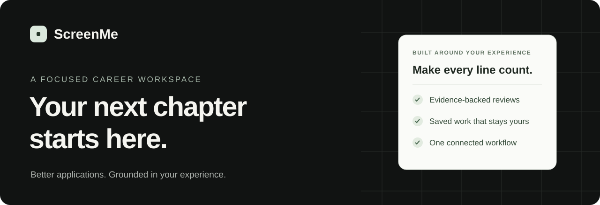
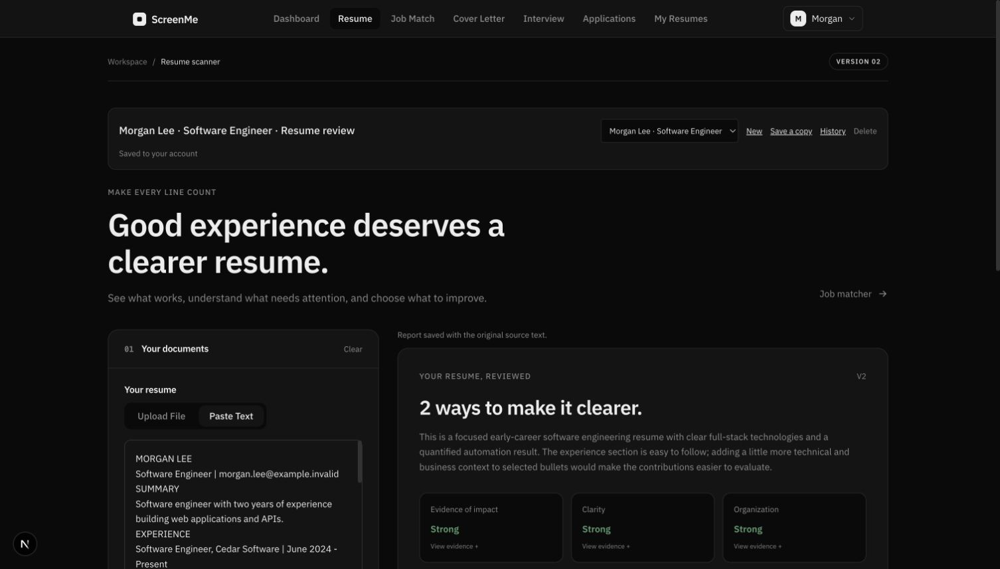
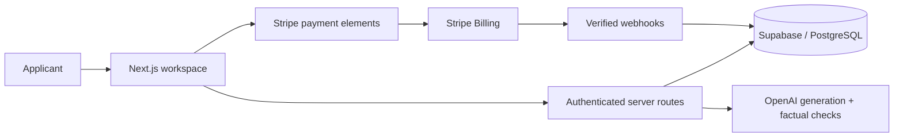

<p align="center"></p>
<p align="center">
  <a href="https://www.screenme.dev">Visit ScreenMe</a> ·
  <a href="#the-workspace">Explore the workspace</a> ·
  <a href="docs/development.md">Developer guide</a> ·
  <a href="CHANGELOG.md">What's new</a>
</p>
<p align="center">
  <a href="https://github.com/syedarman1/screenme/actions/workflows/ci.yml"></a>
  
  
  
</p>

ScreenMe helps applicants turn their experience into thoughtful applications. Review a resume with quoted evidence, compare it with a role, prepare tailored writing, and keep the work connected to an application—all in one account.

**The principle:** help people describe what they have done clearly. AI suggestions are checked against source material; users review the facts before applying. A match percentage describes evidence coverage, not a probability of getting hired.

## The workspace

| Feature | What you can do |
| --- | --- |
| **Resume review** | Examine clarity, impact and organization with source quotes and practical edits. |
| **Job comparison** | Separate supported, partial and missing evidence across required and preferred qualifications. |
| **Tailoring & letters** | Generate editable drafts with a separate factual check and document export. |
| **Interview practice** | Build honest answer outlines and practice spoken answers with coaching. |
| **Saved work** | Recover drafts after refresh, revisit completed reports and restore earlier versions. |
| **Resume library** | Read and download saved resumes; carry a copy directly into a tool. |
| **Applications** | Track a role and connect its resume, letter, comparisons and interview preparation. |
| **Account & support** | Manage membership, inspect tool activity and submit support requests with a reference. |

<p align="center"></p>
<p align="center"><sub>A saved resume review using synthetic example data.</sub></p>

## Built to hold up beyond the happy path

- **Private by account.** Server-verified identities, owner-scoped storage and restricted database writes.
- **Usage you can trust.** Atomic reservations enforce plan limits; failed generations refund their allowance.
- **Recoverable work.** Revision checks detect conflicting edits; saved reports remain accessible after an allowance runs out.
- **Durable billing.** Stripe signatures are verified, fulfillment is transactional and duplicate events are safe to retry.
- **Useful operations.** A private support queue and content-free AI activity metrics help maintain the product.

These safeguards reduce risk; they do not make AI infallible. See the [launch validation](docs/launch-validation.md) and [release runbook](docs/connected-workflow-release.md) for tested scenarios and limits.

## Run locally

Requires **Node 22.23.2** and an isolated development Supabase project. Use Stripe **test-mode** credentials.

```sh
npm ci
cp .env.example .env.local
# Fill in development credentials before starting.
npm run dev
```

Database setup is explicit: new empty databases use the schema checkpoint plus timestamped migrations; existing installations use only unapplied migrations. Follow the [developer guide](docs/development.md) before applying anything.

```sh
npm run lint
npm run typecheck
npm test
npm run build
```

CI also runs real PostgreSQL tests for ownership, concurrency, quotas, report history and billing transactions. Running `npm test` without a disposable database skips that group; the [full verification instructions](docs/development.md#validation) explain how to run everything. Funded AI evaluations and Stripe lifecycle tests are separate from the default test suite.

## Architecture

Read the [engineering decisions and code map](docs/architecture.md) for evidence validation, scoring, request accounting and implementation tradeoffs.



| Layer | Technology |
| --- | --- |
| Interface | Next.js App Router, React, TypeScript, Tailwind CSS |
| Identity & data | Supabase Auth, PostgreSQL, row-level security |
| Analysis & writing | OpenAI, structured responses, source validation |
| Subscriptions | Stripe Checkout Sessions, Payment Element, Express Checkout |
| Delivery | Vercel; Resend SMTP for account emails |
| Quality | Node test runner, disposable PostgreSQL, ESLint, TypeScript, GitHub Actions |

## Repository guide

```text
src/app/              Product pages, components and server routes
src/app/lib/          Analysis, writing, billing and data contracts
supabase/             Schema checkpoint, migrations and email templates
tests/                API, database, billing, document and AI guard tests
scripts/              Explicit integration checks and funded evaluations
docs/                 Architecture notes, audits and release procedures
```

[Contributing](CONTRIBUTING.md) · [Security reporting](SECURITY.md) · [Changelog](CHANGELOG.md) · [Product support](https://www.screenme.dev/contact)

This repository is publicly viewable. No open-source license grant is currently included; do not assume redistribution rights.
